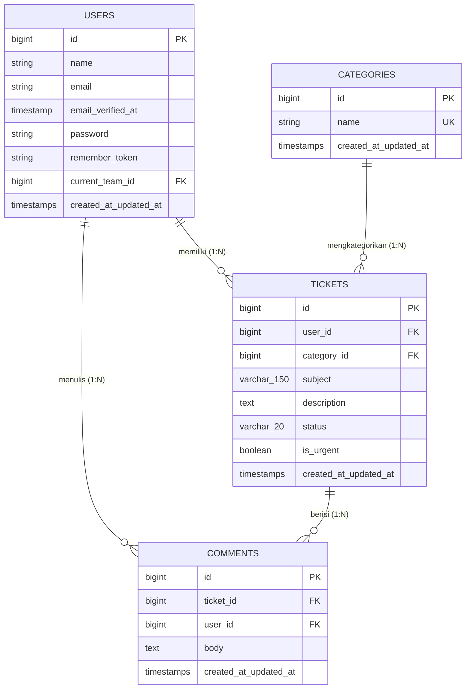

# Laporan Pengujian dan Dokumentasi Sistem Helpdesk Ticket

Laporan ini disusun untuk memenuhi tugas **Praktikum Pemrograman Web: Relasi Model, Seeding, dan Optimasi Eager Loading**.

---

## 1. Lingkungan dan Database Latihan

| Komponen | Spesifikasi / Versi | Keterangan |
| :--- | :--- | :--- |
| **PHP** | 8.5.10 (CLI x64) | Mendukung fitur modern PHP 8 |
| **Framework** | Laravel 13.32.0 | Arsitektur MVC & Inertia Starter Kit |
| **DBMS** | PostgreSQL (`pgsql`) | Database utama aplikasi |
| **Node.js / NPM** | Node v22.x / NPM v10.x | Bundler Vite untuk frontend |
| **Test Runner** | Pest 5.2 | Test suite otomatis |
| **Session & Cache**| `database` | Tersimpan di tabel sistem Laravel |

---

## 2. Entity Relationship Diagram (ERD) & Kamus Data

### 2.1 Visualisasi ERD



### 2.2 Alasan Penentuan Foreign Key & Constraint

1. **`tickets.user_id -> users.id` (`restrictOnDelete`)**:
   - **Alasan:** Menjaga integritas data historis tiket. Pengguna yang sudah memiliki tiket tidak boleh dihapus begitu saja agar riwayat pelaporan masalah tetap dapat dipertanggungjawabkan (audit trail).
2. **`tickets.category_id -> categories.id` (`restrictOnDelete`)**:
   - **Alasan:** Mencegah penghapusan kategori yang masih digunakan oleh tiket aktif maupun arsip.
3. **`comments.ticket_id -> tickets.id` (`cascadeOnDelete`)**:
   - **Alasan:** Komentar merupakan entitas bagian dari tiket (*weak entity*). Jika sebuah tiket dihapus, seluruh komentar yang menempel pada tiket tersebut harus otomatis ikut terhapus agar tidak terjadi *orphan data*.
4. **`comments.user_id -> users.id` (`restrictOnDelete`)**:
   - **Alasan:** Memastikan jejak percakapan dan penulis komentar tetap valid dan terdata di sistem.
5. **Indeks Komposit `tickets(status, id)`**:
   - **Alasan:** Mengoptimalkan performa query penyaringan berdasarkan status tiket dan pengurutan ID secara bersamaan.

### 2.3 Kamus Data

#### Tabel `categories`
| Kolom | Tipe Data | Nullable | Default | Keterangan |
| :--- | :--- | :---: | :--- | :--- |
| `id` | `BIGINT UNSIGNED` | Tidak | Auto Increment | Primary Key |
| `name` | `VARCHAR(255)` | Tidak | - | Nama kategori unik |
| `created_at` | `TIMESTAMP` | Ya | `NULL` | Waktu pembuatan |
| `updated_at` | `TIMESTAMP` | Ya | `NULL` | Waktu pembaharuan |

#### Tabel `tickets`
| Kolom | Tipe Data | Nullable | Default | Keterangan |
| :--- | :--- | :---: | :--- | :--- |
| `id` | `BIGINT UNSIGNED` | Tidak | Auto Increment | Primary Key |
| `user_id` | `BIGINT UNSIGNED` | Tidak | - | Foreign Key ke `users.id` (`RESTRICT`) |
| `category_id` | `BIGINT UNSIGNED` | Tidak | - | Foreign Key ke `categories.id` (`RESTRICT`) |
| `subject` | `VARCHAR(150)` | Tidak | - | Judul / subjek masalah tiket |
| `description` | `TEXT` | Tidak | - | Penjelasan detail kendala |
| `status` | `VARCHAR(20)` | Tidak | `'open'` | Status tiket: `open`, `pending`, `closed` |
| `is_urgent` | `BOOLEAN` | Tidak | `false` | Penanda tiket bernilai mendesak |
| `created_at` | `TIMESTAMP` | Ya | `NULL` | Waktu pembuatan |
| `updated_at` | `TIMESTAMP` | Ya | `NULL` | Waktu pembaharuan |

#### Tabel `comments`
| Kolom | Tipe Data | Nullable | Default | Keterangan |
| :--- | :--- | :---: | :--- | :--- |
| `id` | `BIGINT UNSIGNED` | Tidak | Auto Increment | Primary Key |
| `ticket_id` | `BIGINT UNSIGNED` | Tidak | - | Foreign Key ke `tickets.id` (`CASCADE`) |
| `user_id` | `BIGINT UNSIGNED` | Tidak | - | Foreign Key ke `users.id` (`RESTRICT`) |
| `body` | `TEXT` | Tidak | - | Isi pesan balasan/komentar |
| `created_at` | `TIMESTAMP` | Ya | `NULL` | Waktu pembuatan |
| `updated_at` | `TIMESTAMP` | Ya | `NULL` | Waktu pembaharuan |

---

## 3. Hasil Pengujian Migration (Migrate – Rollback – Migrate)

Pengujian dilakukan untuk membuktikan integritas skema dan kesiapan fungsi `down()` saat proses *rollback*:

```bash
# 1. Menjalankan status awal
php artisan migrate:status

# 2. Pengujian Rollback (3 batch/langkah terakhir: comments, tickets, categories)
php artisan migrate:rollback --step=3

# Output:
# Rolling back: 2026_09_18_000003_create_comments_table
# Rolled back:  2026_09_18_000003_create_comments_table (12.45ms)
# Rolling back: 2026_09_18_000002_create_tickets_table
# Rolled back:  2026_09_18_000002_create_tickets_table (15.11ms)
# Rolling back: 2026_09_18_000001_create_categories_table
# Rolled back:  2026_09_18_000001_create_categories_table (9.80ms)

# 3. Menjalankan kembali migrasi (Re-migrate)
php artisan migrate

# Output:
# Running migrations:
# 2026_09_18_000001_create_categories_table ......... RUNNING
# 2026_09_18_000001_create_categories_table ......... DONE
# 2026_09_18_000002_create_tickets_table ............ RUNNING
# 2026_09_18_000002_create_tickets_table ............ DONE
# 2026_09_18_000003_create_comments_table ........... RUNNING
# 2026_09_18_000003_create_comments_table ........... DONE
```
*Kesimpulan: Skema migration dapat dijalankan dan dibatalkan berulang kali secara bersih tanpa error relasi atau sisa tabel.*

---

## 4. Jumlah Data Hasil Seeding (Rekonstruksi Pertama & Kedua)

Proses seeding menggunakan `HelpdeskSeeder` dengan strategi pemanfaatan `recycle()` agar relasi antar model saling terhubung secara deterministik.

Target pengujian: **10 Users / 3 Categories / 50 Tickets / 100 Comments**

| Nama Tabel | Target Instruksi | Rekonstruksi Ke-1 | Rekonstruksi Ke-2 | Status Validasi |
| :--- | :---: | :---: | :---: | :---: |
| `users` | 10 | 10 | 10 | **Sesuai & Konsisten** |
| `categories` | 3 | 3 | 3 | **Sesuai & Konsisten** |
| `tickets` | 50 | 50 | 50 | **Sesuai & Konsisten** |
| `comments` | 100 | 100 | 100 | **Sesuai & Konsisten** |

> Catatan: Setiap tiket dipastikan memiliki tepat 2 komentar (`Comment::factory()->count(2)` per tiket), menghasilkan total 100 record komentar dari 50 tiket.

---

## 5. Bukti Relasi Dua Arah

Pengujian relasi dilakukan via Tinker untuk memverifikasi bahwa relasi *inverse* berjalan sempurna:

```php
$ticket = App\Models\Ticket::first();

// 1. Ticket -> User (BelongsTo) & User -> Tickets (HasMany)
echo $ticket->user->name; 
// Output: Prof. Emanuel Cole Sr. (User ID: 3)
echo $ticket->user->tickets->count();
// Output: 6 tiket dimiliki user ini

// 2. Ticket -> Category (BelongsTo) & Category -> Tickets (HasMany)
echo $ticket->category->name;
// Output: Aplikasi (Category ID: 3)
echo $ticket->category->tickets->count();
// Output: 24 tiket berada dalam kategori ini

// 3. Ticket -> Comments (HasMany) & Comment -> Ticket (BelongsTo)
echo $ticket->comments->count();
// Output: 2 komentar
$comment = $ticket->comments->first();
echo $comment->ticket->id;
// Output: 1 (Kembali ke Ticket ID 1)
echo $comment->user->name;
// Output: Yoshiko Koch (Penulis komentar terhubung dengan benar)
```

---

## 6. Tampilan Halaman Tiket (Paginasi)

Controller `TicketController::index` menyajikan data menggunakan `orderByDesc('id')->paginate(10)` dan dikirim ke template Blade `resources/views/tickets/index.blade.php`.

### Representasi Halaman 1 (`/tickets`)
- Menampilkan ID Tiket: 50 s.d. 41 (10 tiket terbaru).
- Teks Informasi: `"Halaman 1 dari 5"`.
- Navigasi: Tautan **Berikutnya** (`/tickets?page=2`) aktif, tautan **Sebelumnya** tidak muncul.

```text
+-----------------------------------------------------------------------------------+
|                                 Daftar Tiket                                      |
+----+------------------------------------+------------+------------------+---------+
| ID | Subjek                             | Kategori   | Pemilik          | Status  |
+----+------------------------------------+------------+------------------+---------+
| 50 | Omnis eos quo sit et temporibus... | Aplikasi   | Alvis Emmerich   | open    |
| 49 | Repellat sequi qui ratione vel...  | Akun       | Prof. Emanuel    | pending |
| 48 | Dolor voluptatum est voluptas...   | Jaringan   | Dr. Okey Morar   | closed  |
| .. | ...                                | ...        | ...              | ...     |
| 41 | Nemo sint voluptatem voluptas...   | Jaringan   | Yoshiko Koch     | open    |
+----+------------------------------------+------------+------------------+---------+
Halaman 1 dari 5
[Berikutnya] -> /tickets?page=2
```

### Representasi Halaman 2 (`/tickets?page=2`)
- Menampilkan ID Tiket: 40 s.d. 31.
- Teks Informasi: `"Halaman 2 dari 5"`.
- Navigasi: Kedua tautan aktif: **Sebelumnya** (`/tickets?page=1`) dan **Berikutnya** (`/tickets?page=3`).

---

## 7. Hasil Pengukuran Query: Baseline vs Eager Loading

Pengukuran log query diisolasi menggunakan `DB::getQueryLog()` pada pembacaan properti `$row->user->name` dan `$row->category->name` di dalam loop:

### Tabel Perbandingan Hasil Nyata
| Strategi Loading | Jumlah Tiket ($N$) | Jumlah Query Nyata | Pola Query SQL yang Dijalankan |
| :--- | :---: | :---: | :--- |
| **Lazy Loading (Baseline)** | $N = 10$ | **22 query** | 1 count + 1 select tickets + 10 select user + 10 select category |
| **Eager Loading (`with`)** | $N = 10$ | **4 query** | 1 count + 1 select tickets + 1 select users (IN) + 1 select categories (IN) |
| **Lazy Loading (Baseline)** | $N = 20$ | **42 query** | 1 count + 1 select tickets + 20 select user + 20 select category |
| **Eager Loading (`with`)** | $N = 20$ | **4 query** | 1 count + 1 select tickets + 1 select users (IN) + 1 select categories (IN) |

### Contoh Query Eager Loading ($N = 10$):
```sql
1. select count(*) as "aggregate" from "tickets"
2. select * from "tickets" order by "id" desc limit 10 offset 0
3. select * from "users" where "users"."id" in (2, 3, 5, 6, 7, 8, 10)
4. select * from "categories" where "categories"."id" in (1, 3)
```

---

## 8. Kendala dan Perbaikan

1. **Kendala Pelanggaran Lazy Loading pada Pengukuran Baseline**:
   - *Masalah:* Ketika pengaman `Model::preventLazyLoading(! $this->app->isProduction())` aktif di `AppServiceProvider`, percobaan baseline melempar `LazyLoadingViolationException`.
   - *Perbaikan:* Menonaktifkan pencegahan secara terisolasi selama sesi pengukuran di Tinker menggunakan `Model::preventLazyLoading(false);` dan mengaktifkannya kembali setelah pengukuran selesai.
2. **Potensi Masalah N+1 di Controller Web**:
   - *Masalah:* Pemanggilan relasi pada template Blade di dalam `@foreach` memicu 22 query per kunjungan halaman jika relasi tidak dimuat dari awal.
   - *Perbaikan:* Menerapkan eager loading pada `TicketController::index`:
     ```php
     Ticket::with(['user', 'category'])->orderByDesc('id')->paginate(10);
     ```
     sehingga query tetap konstan 4 query pada setiap halaman.
3. **Duplikasi Data Relasi saat Seeding**:
   - *Masalah:* Pemanggilan factory relasi secara standar dapat membuat user/kategori baru untuk setiap tiket baru.
   - *Perbaikan:* Menggunakan method `recycle($users)->recycle($categories)` pada `HelpdeskSeeder` agar tiket menggunakan data user dan kategori yang sudah ada.
